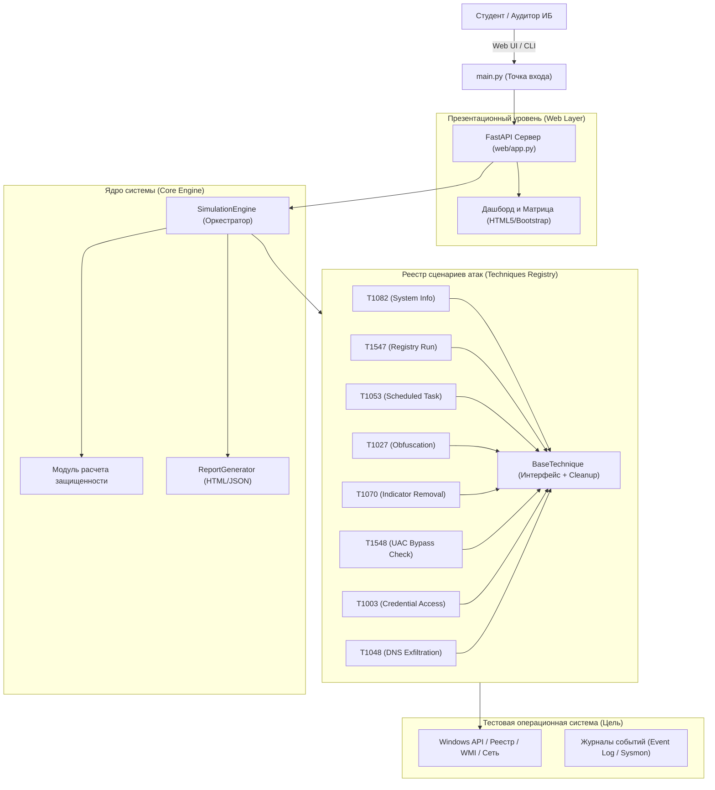
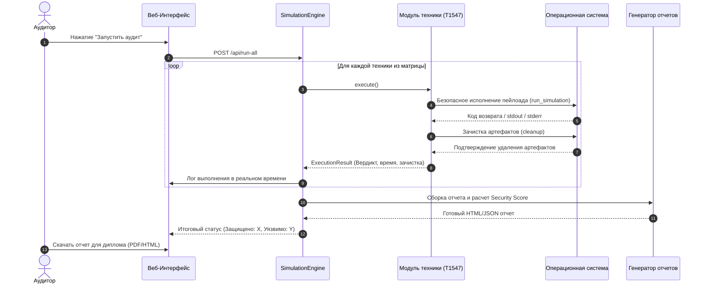

# Архитектура программного комплекса «Атака-Тест» (BAS)

## 1. Диаграмма компонентов системы

```mermaid
graph TD
    User["Студент / Аудитор ИБ"] -->|Web UI / CLI| Main["main.py (Точка входа)"]
    
    subgraph Web["Презентационный уровень (Web Layer)"]
        FastAPI["FastAPI Сервер (web/app.py)"]
        Dashboard["Дашборд и Матрица (HTML5/Bootstrap)"]
    end

    subgraph Core["Ядро системы (Core Engine)"]
        Engine["SimulationEngine (Оркестратор)"]
        Evaluator["Модуль расчета защищенности"]
        Reporter["ReportGenerator (HTML/JSON)"]
    end

    subgraph Techniques["Реестр сценариев атак (Techniques Registry)"]
        T_Base["BaseTechnique (Интерфейс + Cleanup)"]
        T1["T1082 (System Info)"] --> T_Base
        T2["T1547 (Registry Run)"] --> T_Base
        T3["T1053 (Scheduled Task)"] --> T_Base
        T4["T1027 (Obfuscation)"] --> T_Base
        T5["T1070 (Indicator Removal)"] --> T_Base
        T6["T1548 (UAC Bypass Check)"] --> T_Base
        T7["T1003 (Credential Access)"] --> T_Base
        T8["T1048 (DNS Exfiltration)"] --> T_Base
    end

    subgraph Target["Тестовая операционная система (Цель)"]
        OS["Windows API / Реестр / WMI / Сеть"]
        SIEM["Журналы событий (Event Log / Sysmon)"]
    end

    Main --> FastAPI
    FastAPI --> Dashboard
    FastAPI --> Engine
    Engine --> Techniques
    Techniques --> OS
    Engine --> Evaluator
    Engine --> Reporter
```

---

## 2. Диаграмма последовательности эмуляции техники (Sequence Diagram)

```mermaid
sequenceDiagram
    autonumber
    actor Auditor as Аудитор
    participant UI as Веб-Интерфейс
    participant Engine as SimulationEngine
    participant Tech as Модуль техники (T1547)
    participant Host as Операционная система
    participant Reporter as Генератор отчетов

    Auditor->>UI: Нажатие "Запустить аудит"
    UI->>Engine: POST /api/run-all
    loop Для каждой техники из матрицы
        Engine->>Tech: execute()
        Tech->>Host: Безопасное исполнение пейлоада (run_simulation)
        Host-->>Tech: Код возврата / stdout / stderr
        Tech->>Host: Зачистка артефактов (cleanup)
        Host-->>Tech: Подтверждение удаления артефактов
        Tech-->>Engine: ExecutionResult (Вердикт, время, зачистка)
        Engine->>UI: Лог выполнения в реальном времени
    end
    Engine->>Reporter: Сборка отчета и расчет Security Score
    Reporter-->>Engine: Готовый HTML/JSON отчет
    Engine-->>UI: Итоговый статус (Защищено: X, Уязвимо: Y)
    Auditor->>UI: Скачать отчет для диплома (PDF/HTML)
```
